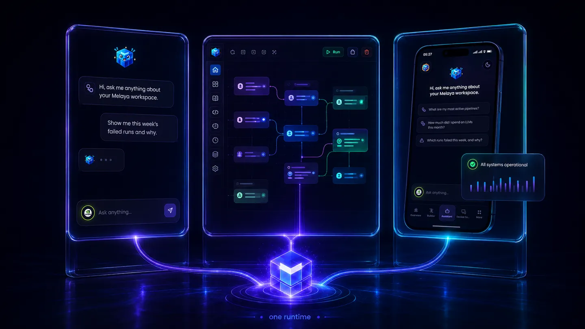
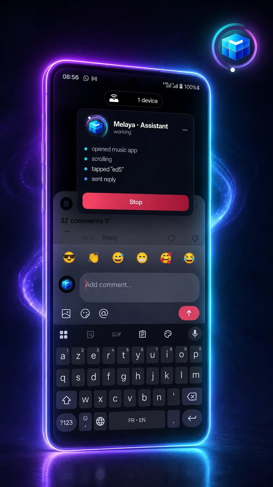
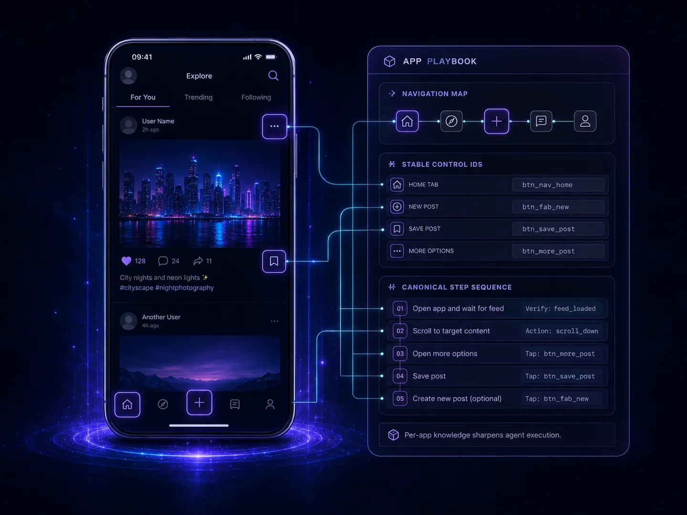
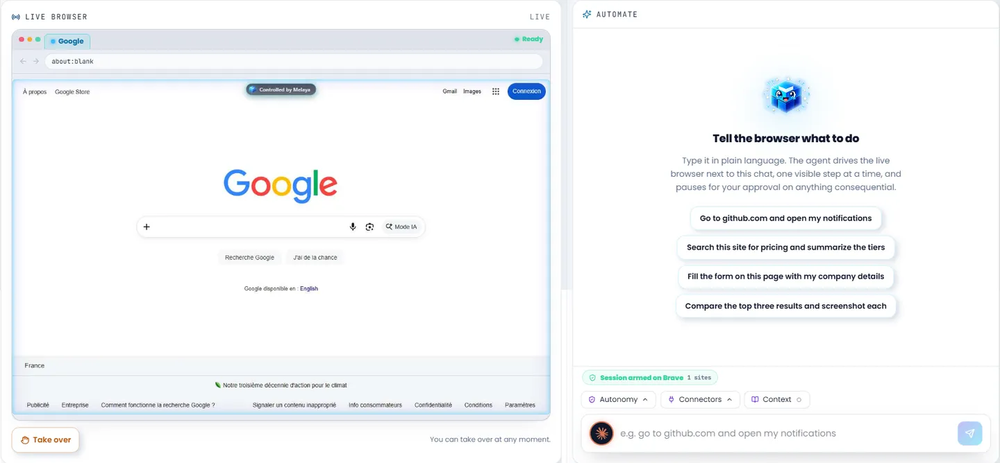
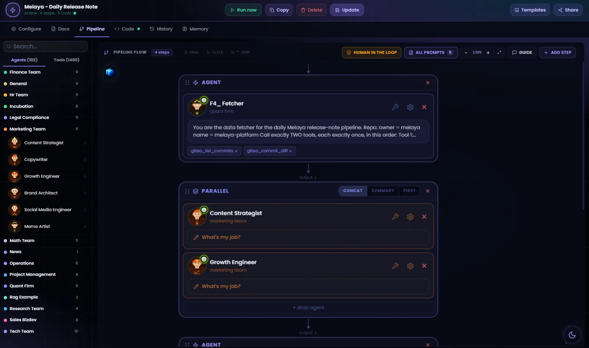
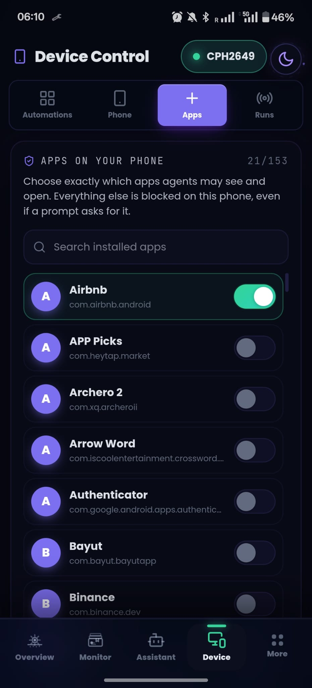
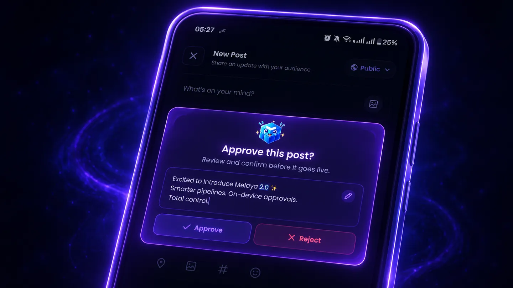
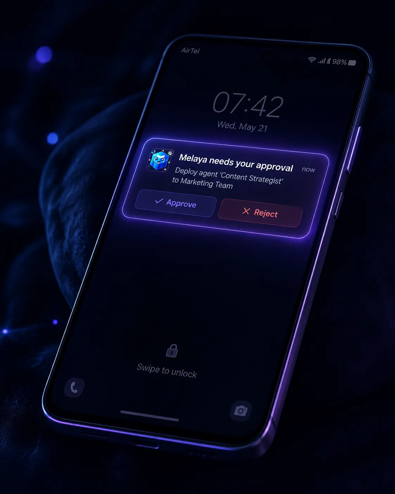

<div align="center">

<picture>
  <source media="(prefers-color-scheme: dark)" srcset="assets/brand/melaya_horizontal_dark.webp">
  
</picture>

# Melaya MCP Server

**Let an AI assistant use your Android phone, your browser, and the rest of your Melaya account.**

[](https://registry.modelcontextprotocol.io)
[](https://github.com/melaya-labs/melaya-mcp/releases)
[](https://smithery.ai/servers/info-h530/melaya)
[](https://mcpservers.org/servers/melaya-labs/melaya-mcp)
[](https://glama.ai/mcp/servers/@melaya-labs/melaya-mcp)
[](#what-it-can-do)
[](#permissions)
[](#give-your-ai-the-melaya-skill)
[](./LICENSE)

<sub>Also listed on [mcp.so](https://mcp.so/servers/melaya-1f614a) · [mcpserver.dev](https://mcpserver.dev/s/melaya_1f0eb4j) · [mcpmarket](https://mcpmarket.com/server/melaya) · [cursor.directory](https://cursor.directory/plugins/melaya) · [Glama](https://glama.ai/mcp/servers/melaya-labs/melaya-mcp) · [Product Hunt](https://www.producthunt.com/products/melaya) · [AlternativeTo](https://alternativeto.net/software/melaya/about/) · [SaaSHub](https://www.saashub.com/melaya) · [AI Agents Directory](https://aiagentsdirectory.com/agent/melaya) · [AgentLocker](https://agentlocker.ai/agent/melaya) · [LaunchKiwi](https://launchkiwi.com/p/melaya)</sub>

[Documentation](https://github.com/melaya-labs/melaya/blob/main/docs/mcp.md) · [Melaya](https://melaya.org) · [Device Control](https://melaya.org/en/product/agentic-device-control) · [MCP Server](https://melaya.org/en/product/mcp)

</div>

<p align="center">
  
</p>

Melaya pairs a phone to your account and gives an agent the same view of it a person has: it reads the screen through Android's accessibility tree, then taps, types, swipes, and moves between apps. No per-app integration, no vendor API. **If you can use the app, so can the agent.**

This is a remote [Model Context Protocol](https://modelcontextprotocol.io) server. MCP is a vendor-neutral standard, so one endpoint works everywhere:

```
https://api.melaya.org/mcp
```

Nothing to install, no SDK required.

## Connect

<table>
<tr>
<td width="120" align="center"><br><b>Claude Code</b></td>
<td>

```bash
claude mcp add --transport http melaya https://api.melaya.org/mcp
```

</td>
</tr>
<tr>
<td width="120" align="center"><br><b>Codex CLI</b></td>
<td>

```bash
codex mcp add melaya --url https://api.melaya.org/mcp
```

Direct HTTP needs `experimental_use_rmcp_client = true` in `~/.codex/config.toml`.

</td>
</tr>
<tr>
<td width="120" align="center"><br><b>Cursor</b></td>
<td>

`~/.cursor/mcp.json`, or `.cursor/mcp.json` for one project:

```json
{ "mcpServers": { "melaya": { "url": "https://api.melaya.org/mcp" } } }
```

</td>
</tr>
<tr>
<td width="120" align="center"><br><b>Claude</b></td>
<td>

claude.ai, Desktop and mobile: **Settings → Connectors → Add custom connector**, paste `https://api.melaya.org/mcp`

</td>
</tr>
<tr>
<td width="120" align="center"><br><b>ChatGPT</b></td>
<td>

**Settings → Connectors → Developer mode**, paste the same endpoint

</td>
</tr>
<tr>
<td width="120" align="center"><br><b>Le Chat</b></td>
<td>

**Connectors → Add custom MCP connector**

</td>
</tr>
<tr>
<td width="120" align="center"><b>VS Code</b></td>
<td>

```bash
code --add-mcp '{"name":"melaya","type":"http","url":"https://api.melaya.org/mcp"}'
```

</td>
</tr>
<tr>
<td width="120" align="center"><b>Everything else</b></td>
<td>

Windsurf, Zed, Cline, Goose, Lovable, Gemini CLI, Qwen Code and any other MCP client take the same block, in whichever file that client uses for MCP servers:

```json
{ "mcpServers": { "melaya": { "url": "https://api.melaya.org/mcp" } } }
```

</td>
</tr>
</table>

Authentication is OAuth 2.1 with PKCE. You choose which permissions to grant on a Melaya consent page; the assistant receives a scoped token. Your password is never shared.

Then just ask:

> Connect my phone and go through my unread Instagram DMs.

---

## Give your AI the Melaya skill

This server gives your assistant the tools. The **[Melaya skill](https://github.com/melaya-labs/melaya-mcp/tree/main/skills/melaya)** gives it the method: which tool to call first, how to connect services, build and validate a pipeline on a real run, set triggers and approvals, and read results. Install both and your assistant gets real work right the first time instead of guessing.

**Any assistant** (ChatGPT, Gemini, Cursor, …): paste this line.

```text
Install the Melaya skill from https://github.com/melaya-labs/melaya-mcp/tree/main/skills/melaya and use it whenever I ask you to work with Melaya.
```

**Claude Code**: the Melaya plugin from this repo already bundles it, next to `melaya-setup`. Installing the plugin is enough. To use the skill on its own, copy it into your skills folder, then restart. It loads on its own when you mention Melaya.

```bash
git clone --depth 1 https://github.com/melaya-labs/melaya-mcp /tmp/melaya-mcp && cp -r /tmp/melaya-mcp/skills/melaya ~/.claude/skills/
```

**Claude.ai and Claude Desktop**: download [`skills/melaya`](https://github.com/melaya-labs/melaya-mcp/tree/main/skills/melaya) as a .zip and upload it under **Settings → Capabilities → Skills**. Anywhere else, add [`SKILL.md`](https://github.com/melaya-labs/melaya-mcp/blob/main/skills/melaya/SKILL.md) as a project instruction or rules file.

<table>
<tr>
<td width="50%" valign="top"><b>Starts right</b><br><sub>Opens every session with <code>melaya_setup_status</code> and closes each gap it reports before doing anything else.</sub></td>
<td width="50%" valign="top"><b>Stays safe</b><br><sub>Never asks for a key in chat, never decides an approval for you, confirms before anything is sent or deleted.</sub></td>
</tr>
<tr>
<td width="50%" valign="top"><b>Builds pipelines that run</b><br><sub>Reads the config before changing it, previews before saving, and judges a run by its real output, not its status.</sub></td>
<td width="50%" valign="top"><b>Loads only what it needs</b><br><sub>One short router plus eleven modules: quickstart, pipelines, agentic systems, data, triggers and approvals, devices, handover.</sub></td>
</tr>
</table>

## What it can do

### Operate your phone

Read the screen, open apps, tap, type, scroll, swipe, screenshot. You watch it work, and one control stops everything.

<p align="center">
  
</p>

Melaya ships navigation playbooks for common apps, so the agent arrives knowing where things are instead of exploring blindly.

<p align="center">
  
</p>

### Operate a browser

The same read-act-verify loop on a desktop site, through the Melaya extension on Chrome or Edge. **You attach the tab; the model never picks one.** Several conversations, pipelines and the extension panel can work in the same browser at once, each in its own tab (up to 8): attach returns an `agent` id that the conversation passes on every browser call, and a tab another agent is using is never touched.

<p align="center">
  
</p>

It can also **debug** the page it is on: network activity, console output, and a performance diagnosis that ranks causes with the file and the number behind each, rather than handing over a raw panel. Credential values are redacted at capture, before anything reaches the model.

### Build and run agents

Create a project for the work (one per client pilot, say), list the template library and instantiate a validated template, or author a pipeline from scratch, validate it before saving, schedule it, and watch it run. Hand a long or recurring job to an autonomous agent on your own machine, on your own model subscription, that carries on after the conversation ends.

<p align="center">
  
</p>

### Read, and act through, your connected services

Mail, documents, your ERP. **Read-only by default, structurally**: without the separate write permission the write path is blocked in two independent places, so a write stays blocked even if Melaya's own tool catalog is out of date.

Grant `melaya:connectors.write` as well and the assistant can act for you there too: send an email, create or update a record or a file. **Anything that moves money or trades is excluded at every permission level**: payments, refunds, purchases, transfers, ad-spend changes and orders are refused by the server, and again by the executor, and stay with you in the Melaya app. Every write made this way is audit-logged.

### Manage projects

Create a project, rename it or edit its description, and delete it once it is empty. Delete is a dry run until confirmed, only the project's creator can do it, and a project that still holds pipelines, run history or other members is refused. Plan limits apply exactly as in the app.

### Find out what happened

Runs, transcripts, tool traces, failure diagnosis, cost, and what your agents have learned across runs.

---

## What it cannot do

Enforced by the device or by the Melaya server, not by instructions, so no prompt and no agent instruction can move them.

### It only touches what you allow-list

Apps on the phone, origins in the browser. The agent can hand access back, narrowing the list or clearing it, but **only you widen it**: phone apps on your phone or in the Melaya app, and browser sites on the Melaya Browser Control page or by asking your assistant to add one (it then calls `melaya_browser_allow_sites` with that site; you can also ask it for every site). The skills tell it never to widen access on its own or because of something it read.

<p align="center">
  
</p>

That asymmetry is deliberate. The agent reads text off your screen, and text can be written by anyone: a message, a comment, a web page. A boundary it could widen in response to what it reads would not be a boundary.

### Payments on your phone always ask you

Direct phone control from your assistant runs in safe mode: publishing and paying stage an approval card, and you see the exact text before anything goes out. Phone agents and phone pipelines your assistant starts or saves keep the payment card in every mode: `autonomous` is stored and run as `payments_only` from here, which lets an agent publish without a card you asked it to skip, but still stops before every purchase or payment. Only you can set a fully unattended phone mode, in the Melaya app. In the browser, the autonomy you choose in the Melaya extension decides (safe asks before purchases, publishing and other consequential actions; payments only asks before purchases; autonomous asks nothing). Approvals reach you even when the phone is locked.

<p align="center">
  
  &nbsp;
  
</p>

### There is a STOP control

On the phone overlay and in the Melaya app. It halts everything immediately, across every agent and every connected assistant.

### Approvals are listed here, never decided here

The gate exists to put a human between an agent and a consequential action, and the caller here is a model reading untrusted content. You approve in the Melaya app or on your phone.

Password fields are excluded from screen reads.

LinkedIn is not available on this surface: automating it through a logged-in session breaks LinkedIn's terms, so the server refuses the LinkedIn tools, the LinkedIn app on your phone and linkedin.com in your browser.

Also deliberately absent, and enforced by tests rather than by convention: **trading and moving money through a connector** (they write against live exchange keys and payment accounts), **administration** (no honest consent sentence exists for it), and **reading or setting connector credentials** (you connect services in the app). Two event-trigger fields are the exception, used only if you choose to hand a secret to your assistant instead of pasting it in the app: a provider's webhook signing secret and a stream source's key. Both are stored encrypted and never returned.

---

## Permissions

Ten scopes. You grant them individually.

| Scope | What it allows |
|---|---|
| `melaya:read` | Your workspace: pipelines, runs, traces, evaluations, pending approvals |
| `melaya:platform` | Your account and plan: tier, usage against limits, subscription |
| `melaya:runner` | Set up and check the Melaya runner on your computer |
| `melaya:phone` | Operate your paired Android phone, inside apps you allow-listed |
| `melaya:browser` | Operate a connected browser, on sites you allowed |
| `melaya:pipelines` | Create, edit, schedule, run and cancel agent pipelines |
| `melaya:projects` | Create projects, rename them and edit descriptions, delete an empty project you created |
| `melaya:connectors` | Read data from connected services. Read only |
| `melaya:connectors.write` | Act through connected services: send emails, create or update records and files. Needs `melaya:connectors`. Never moves money or trades |
| `melaya:team` | Read project membership, and invite people you name |

The tool list your assistant receives is filtered to what you granted, so connecting for phone control alone shows **23 tools rather than all 88**. If a capability seems missing, you declined it; reconnect and approve it.

> [!NOTE]
> **If you also use the Melaya SDK**, "connectors" means something different there. In the SDK it is project credential storage. Here, `melaya:connectors` is reading data from services you already connected, and `melaya:connectors.write` is acting through them. This surface cannot read, set or delete a connector credential (the trigger signing secret and stream-source key above are the only secrets it accepts, and it never returns them).

## Requirements

- A Melaya account — free at [melaya.org](https://melaya.org)
- An Android phone (Android 8 or newer) for phone control. There is no iOS build.
- The Melaya extension on Chrome or Edge for browser control
- For autonomous agents: Node 18+, Python 3.11+, and a signed-in CLI on the machine hosting the runner. The runner starts from one command pinned to a reviewed release (`npx -y @melaya/runner@1.1.60 --token=...`); your assistant shows it to you and runs it only after you say yes, or hands it to you to run

## Privacy

Screen and page content read during a run goes to Melaya and to whichever model you selected, for the duration of that run. The [privacy policy](https://melaya.org/en/legal/privacy) covers collection, retention and deletion.

One credential does cross the boundary, and it is worth naming: if you set up the optional local runner, the command you are given contains a runner token. It is valid for 7 days, revocable in settings or with `melaya_runner_revoke`, and unavoidable because the runner starts from a command line. On a hosted assistant that command appears in your conversation history. The only other secrets that can appear are a webhook signing secret or stream-source key you choose to give your assistant for an event trigger (stored encrypted, never returned); provider and connector credentials are resolved server-side and never reach the assistant.

Disconnecting in Melaya settings immediately revokes the connection's ability to renew itself. A token it already holds keeps working until it expires, at most one hour.

## What's in this repo

| Path | Purpose |
|---|---|
| `server.json` | Manifest for the [official MCP Registry](https://registry.modelcontextprotocol.io) |
| `.mcp.json` | Remote server declaration |
| `.claude-plugin/`, `skills/`, `commands/` | Claude Code plugin packaging — one distribution of the same server. `skills/melaya` is the [Melaya skill](./skills/melaya) (its only source); `skills/melaya-setup` is the first-run setup skill |

The server itself runs as part of the Melaya platform; this repo is its public manifest, packaging and documentation.

## The rest of the platform

This server is one surface onto Melaya. Its tool domains map to the products
behind them, so if a scope is useful the product page explains what it reaches:

| Product | What it is | `melaya:` scope |
|---|---|---|
| [Melaya Agents](https://melaya.org/en/product/agentic-framework) | Visual builder for agent pipelines, **6,912 tools** and **103 subagents** | `pipelines` |
| [Melaya Assistant](https://melaya.org/en/product/assistant) | The governed operating layer over those agents | `platform` |
| [Device Control](https://melaya.org/en/product/agentic-device-control) | Android phone control through the accessibility tree | `phone` |
| [Melaya Browser Control](https://melaya.org/en/product/agentic-browser-control) | Origin-scoped control of a paired browser | `browser` |
| [Melaya Marketing](https://melaya.org) | Ads, search consoles, analytics, DNS and site in one cockpit, with approval before anything touches real money or your live site | `connectors` |
| [Melaya MCP Server](https://melaya.org/en/product/mcp) | This server | all of the above |

The [browser extension](https://melaya.org/en/blog/melaya-browser-extension) is
what Browser Control talks to, and ships for Chrome, Edge, Brave, Opera and Firefox.

Pricing starts at a $0 Sandbox tier for evaluating the platform during open
beta: [see plans](https://melaya.org/en/pricing).

## Links

- [Full documentation](https://github.com/melaya-labs/melaya/blob/main/docs/mcp.md)
- [Melaya SDKs](https://github.com/melaya-labs/melaya) — nine languages
- [Product overview](https://melaya.org/en/product/mcp) · [All products](https://melaya.org)
- [Privacy Policy](https://melaya.org/en/legal/privacy) · [Terms](https://melaya.org/en/legal/terms)
- [Support](mailto:info@melaya.org)

<div align="center">
<br>
<sub><b>Melaya Labs</b> · <a href="https://melaya.org">melaya.org</a> · <a href="https://discord.gg/2BBMUUdnkj">Discord</a></sub>
</div>

## License

Apache-2.0, matching the [Melaya SDKs](https://github.com/melaya-labs/melaya).

It covers what is in this repository — the registry manifest, the plugin packaging, the skills and this documentation. It is not a licence to the Melaya service itself: using the hosted server at `api.melaya.org` needs a Melaya account and is governed by the [Terms](https://melaya.org/en/legal/terms).
